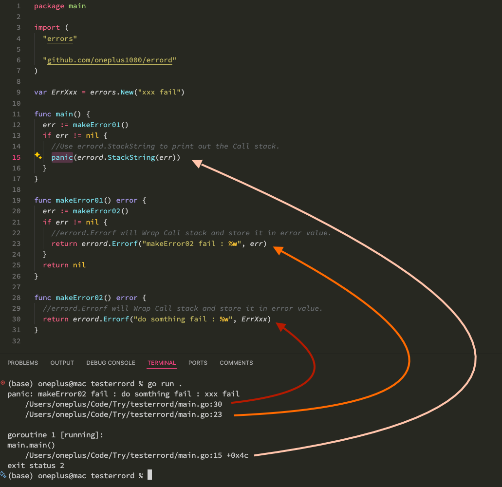

## ERROR DOG :: Assistant that helps you store Call Stack in error value.

Requires minimum go version 1.18.0.

```bash
go get github.com/oneplus1000/errord
```

### Example

To display a StackTrace when an error occurs, you can use the `github.com/oneplus1000/errord` package.

Here's an example:

```GO
package main

import (
  "github.com/oneplus1000/errord"
  "errors"
  "log"
)

var ErrXxx = errors.New("xxx fail")

func main() {
  err := makeError01()
  if err != nil {
    //Use errord.StackString to print out the Call stack.
    panic(errord.StackString(err))
  }
}

func makeError01() error {
  err := makeError02()
  if err != nil {
    //errord.Errorf will Wrap Call stack and store it in error value.
    return errord.Errorf("makeError02 fail : %w",err)
  }
  return nil
}

func makeError02() error {
  //errord.Errorf will Wrap Call stack and store it in error value.
  return errord.Errorf("do somthing fail : %w",ErrXxx)
}


```

### Result


